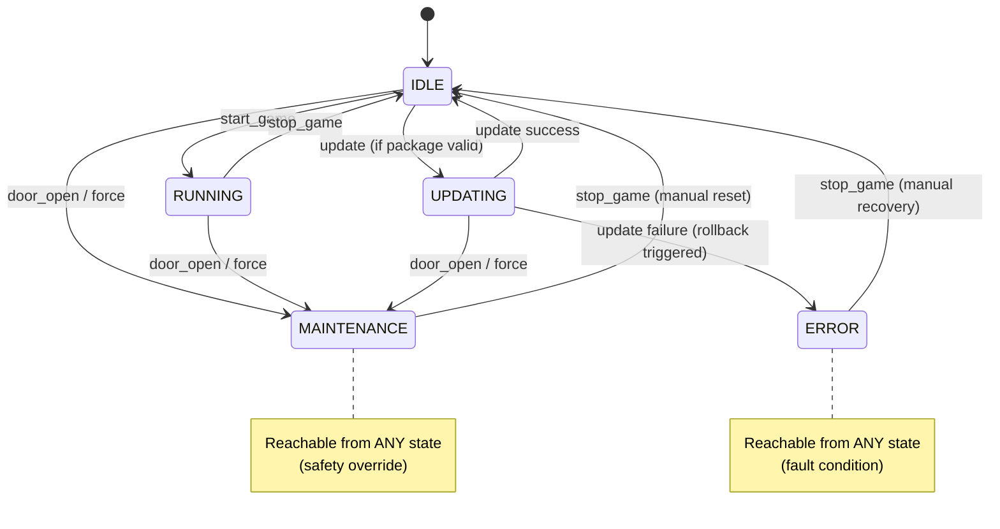
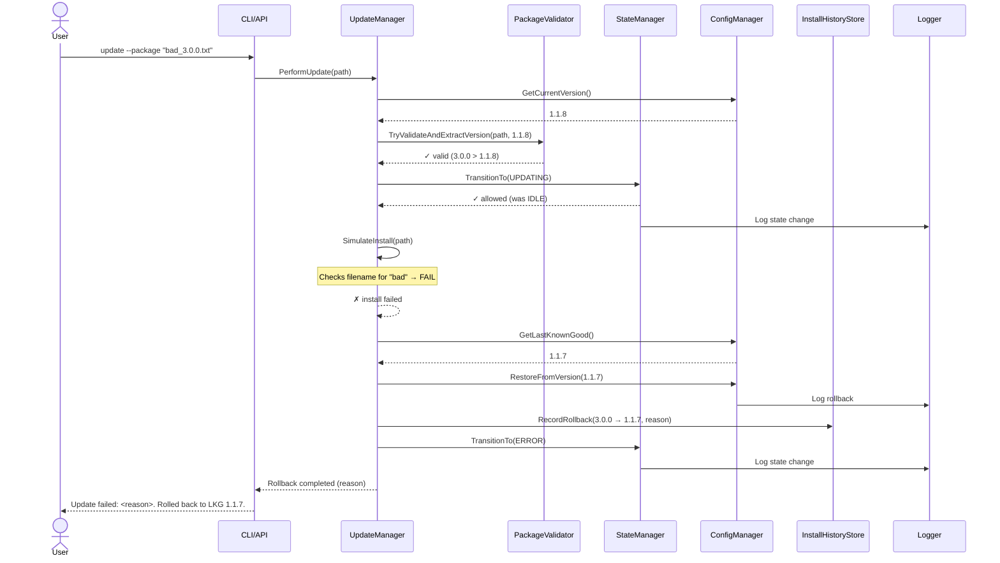

# EGM Architecture Guide

This document explains the design patterns, state machine, threading model, and architectural decisions behind the EGM Core Module.

---

## Table of Contents

1. [Two Front-Ends, One Core](#two-front-ends-one-core)
2. [Design Patterns](#design-patterns)
3. [State Machine](#state-machine)
4. [Update and Rollback Flow](#update-and-rollback-flow)
5. [Threading Model](#threading-model)
6. [Testing Strategy](#testing-strategy)

---

## Two Front-Ends, One Core

The project demonstrates **interface-driven architecture** — the same business logic serves two completely different interfaces:

- **EGM.Core** — Interactive CLI with a command processor loop
- **EGM.Api** — ASP.NET Core Minimal API + React dashboard (no build step)

Both share:
- `StateManager` (FSM)
- `UpdateManager` (transactional updates with rollback)
- `ConfigManager`, `InstallHistoryStore`, `LoggerService`
- All validators, services, and hardware simulators

**Why this matters**: In regulated industries (gaming, medical, aerospace), control logic must be **provably identical** across operational modes. Separating the interface from the core and injecting the same singleton instances guarantees this.

**Trade-off**: Slightly more DI setup, but zero logic duplication and perfect behavioral parity.

---

## Design Patterns

### 1. Finite State Machine (Explicit)
**Where**: `StateManager.cs`

**Why**: EGM state transitions are safety-critical. A bug that allows "UPDATING while RUNNING" could corrupt a live game or fail an audit. An explicit FSM with a transition table makes the allowed paths **visible and testable**.

```csharp
private static readonly Dictionary<EGMStateEnum, List<EGMStateEnum>> _allowedTransitions = new()
{
    { EGMStateEnum.IDLE, new List<EGMStateEnum> { EGMStateEnum.RUNNING, EGMStateEnum.UPDATING, EGMStateEnum.MAINTENANCE } },
    { EGMStateEnum.RUNNING, new List<EGMStateEnum> { EGMStateEnum.IDLE, EGMStateEnum.MAINTENANCE } },
    // ... MAINTENANCE and ERROR are reachable from anywhere (safety escape hatches)
};
```

**Benefit**: Regulators can audit the state diagram. Developers can't accidentally allow invalid transitions.

### 2. Observer (Event-Driven State Changes)
**Where**: `StateManager.OnStateChanged` event

**Why**: The state manager is a **truth source**, not a notification dispatcher. Hardware services and UI layers subscribe to state changes without coupling the StateManager to their existence.

**Critical fix**: The event is fired **outside the lock** to prevent deadlock when subscribers call back into `TransitionTo` or read `CurrentState`.

```csharp
lock (_lock) { /* validate and update state */ }
OnStateChanged?.Invoke(_currentState); // OUTSIDE lock
```

**Test coverage**: `StateManagerTests.Subscriber_ReentrantTransition_ShouldNotDeadlock` ensures this.

### 3. Transactional Update with Compensating Action
**Where**: `UpdateManager.InstallPackage`

**Why**: EGM software updates in a casino are **transactional**: if any step fails (validation, pre-install hook, config write), the entire operation must roll back to the last known good (LKG) state. A half-applied update is worse than no update.

**Flow**:
1. Validate package format and version
2. Transition to UPDATING state (or fail-fast if not IDLE)
3. Run pre-install hook (checks for "bad" in filename — a test seam for failure injection)
4. Write new config + append to install history
5. **On any failure**: `PerformRollback` restores LKG config, logs the event, transitions to IDLE

**Benefit**: The system is never left in an inconsistent state. Auditors can trace every update attempt in `install_history.json`.

### 4. Try-Parse Pattern (Defensive I/O)
**Where**: `FileFunctions.TryWriteFile`, `TryReadFile`; `PackageValidator.TryValidateAndExtractVersion`

**Why**: File I/O and string parsing can fail in production (disk full, corrupted files, wrong format). Throwing exceptions from deep in the call stack clutters higher layers with try-catch noise. The Try-Parse pattern returns `bool` + populates `out` parameters, making failure a **first-class return value**.

```csharp
if (!FileFunctions.TryReadFile(path, out string content, out string error))
{
    _logger.LogError($"Read failed: {error}");
    return false;
}
```

**Benefit**: Call sites stay clean; error messages stay specific.

### 5. Decorator (CapturingLogger)
**Where**: `CapturingLogger.cs` (test helper)

**Why**: Unit tests need to assert on log messages ("Did the system log the rollback?") without hitting the real file system. `CapturingLogger` wraps `ILogger` and records messages in-memory.

**Pattern**: Classic Decorator — same interface, added behavior (capture), delegates to a real or null logger.

### 6. Facade (LoggerService)
**Where**: `LoggerService.cs`

**Why**: The real logger does more than `ILogger.Log`: it rotates files at 5MB, timestamps every line, and creates the Logs directory if missing. `LoggerService` hides that complexity behind a simple `Log(level, message)` interface.

**Benefit**: The rest of the codebase never worries about log rotation or file paths.

---

## State Machine

The EGM has five states. MAINTENANCE and ERROR are reachable from anywhere (safety overrides). All other transitions follow the table below.



**Key rules**:
- **IDLE** is the only state that allows `update`.
- **RUNNING** → **UPDATING** is **blocked** (can't patch a live game).
- **MAINTENANCE** and **ERROR** are escape hatches — you can always force the machine into these states for safety or recovery.
- The FSM enforces these rules in `StateManager._allowedTransitions`.

---

## Update and Rollback Flow

This sequence diagram shows a **failed update** (triggers rollback). A successful update follows the same path but skips the rollback branch.



**Critical properties**:
1. **Atomicity**: If any step after validation fails, the system restores the LKG config before returning.
2. **Audit trail**: Every attempt (success or rollback) appends to `install_history.json`.
3. **State safety**: A failed update lands in ERROR, not IDLE — the operator must acknowledge the failure (`stop_game`) before the machine returns to service.

---

## Threading Model

### Singleton Services + Lock-Based Synchronization

All core services (`StateManager`, `ConfigManager`, `InstallHistoryStore`, `LoggerService`) are registered as **Singletons** in DI. This means:
- The CLI loop and the API endpoints share the **same instances**.
- State changes from one interface are immediately visible to the other.

**Why Singletons**: In a real EGM, there's one physical machine with one state. Scoped or Transient services would create parallel universes.

### Lock Discipline (StateManager)

`StateManager` guards `_currentState` with a `lock` object:

```csharp
private readonly object _lock = new object();
private volatile EGMStateEnum _currentState = EGMStateEnum.IDLE;

public bool TransitionTo(EGMStateEnum newState, string reason)
{
    lock (_lock)
    {
        // validate transition, update _currentState
    }
    OnStateChanged?.Invoke(newState); // OUTSIDE lock to avoid deadlock
}
```

**Why `volatile`**: Readers outside the lock (e.g., `CurrentState` getter for API status checks) see the latest write without acquiring the lock. The write inside the lock establishes a memory barrier.

**Event-outside-lock pattern**: If the event were fired inside the lock, a subscriber that calls `TransitionTo` again would deadlock (trying to re-acquire a non-reentrant lock). Firing outside the lock allows safe re-entry.

### Background Heartbeat (BillValidatorService)

`BillValidatorService` runs a `Timer` that fires every 10 seconds:

```csharp
_heartbeatTimer = new Timer(CheckHeartbeat, null, TimeSpan.FromSeconds(10), TimeSpan.FromSeconds(10));

private void CheckHeartbeat(object? state)
{
    if (!_isAckEnabled && (DateTime.UtcNow - _lastHeartbeat) > TimeSpan.FromSeconds(20))
    {
        _stateManager.ForceState(EGMStateEnum.MAINTENANCE, "Bill validator timeout");
    }
}
```

**Why a Timer, not a `Task.Delay` loop**: `Timer` callbacks run on the thread pool and don't hold a thread. If the callback duration varies, the next tick still fires on schedule (not delayed by the previous callback's execution time).

**Thread-safety**: The callback reads `volatile` fields and calls `ForceState`, which is itself thread-safe (locks internally). No additional synchronization needed.

---

## Testing Strategy

### Coverage: 29.2% overall — why stop there?

| Class | Coverage | Why |
|-------|----------|-----|
| **StateManager** | 92% | Pure logic, fully mockable. The 8% gap is the `Dispose` path (Timer cleanup). |
| **PackageValidator** | 100% | Stateless, no I/O — every branch is reachable. |
| **TimeZoneValidator** | 100% | Wraps `TimeZoneInfo.FindSystemTimeZoneById` — trivial to test. |
| **UpdateManager** | 92% | Core transactional logic. Missing: a real file-write failure (hard to inject without `IFileSystem`). |
| **FileFunctions** | 87% | Static helpers. Missing: the `FindProjectRoot()` failure path (requires a filesystem with no `.csproj` up to root). |
| **ConfigManager** | 0% | Reads/writes real files. Testing would require `IFileSystem` abstraction or temp directories. |
| **InstallHistoryStore** | 0% | Same — direct file I/O. |
| **LoggerService** | 0% | Same — writes real logs. |
| **BillValidatorService** | 0% | Runs a real `Timer`. Stubbing `Timer` or injecting `ITimer` would make tests flaky. |
| **CliProcessor** | 0% | Parses `Console.ReadLine()`. Testing requires `TextReader` injection. |
| **Program.Main** | 0% | Entry point — calls `Environment.Exit`, builds the DI container. Testing would kill the test host. |

### The 100% Coverage Trap

We **chose** to stop at 40 tests and 29.2% coverage because:

1. **Diminishing returns**: The untested code is infrastructure glue (file I/O, console I/O, timers). Getting to 100% would require invasive abstraction (`IFileSystem`, `IConsole`, `ITimer`, `IEnvironment`) — classic over-engineering for a project this size.

2. **Real-world trade-off**: In a production EGM, you'd add integration tests (spin up the API, hit endpoints, verify `Logs/config.json` changed). For this template, unit tests prove the **decision logic** is correct; manual CLI/API testing verifies the **integration**.

3. **Regulatory perspective**: Auditors care that state transitions, updates, and rollbacks are **deterministic and traceable**. The FSM, transactional update, and audit log are 100% covered. File-writing helpers are commodity code.

### What IS Tested

- **All state transitions** (valid, invalid, escape hatches, re-entry deadlock regression).
- **Package validation** (format errors, version checks, missing files).
- **Update rollback** (validation failure, install failure, state guard failure).
- **Timezone validation** (valid/invalid IDs, case insensitivity, empty input).
- **File I/O helpers** (round-trip, missing file, invalid path).

These are the **business rules**. The rest is plumbing.

---

## Summary

| Architectural Principle | Implementation | Why It Matters |
|------------------------|----------------|----------------|
| **Single Source of Truth** | Singleton services shared by CLI and API | State changes are atomic and immediately consistent across interfaces. |
| **Explicit FSM** | `_allowedTransitions` map + guarded state field | Invalid transitions are compile-time impossible, audit-visible, and testable. |
| **Transactional Updates** | Try → Apply → Commit, with compensating rollback | Partial failures never leave the system inconsistent. |
| **Event-outside-lock** | `OnStateChanged?.Invoke()` after releasing lock | Prevents deadlock when subscribers call back into the StateManager. |
| **Try-Parse over Exceptions** | `bool TryX(out result, out error)` pattern | Failure is a first-class return value; call sites stay clean. |
| **Test the Decisions, Not the Plumbing** | 92–100% coverage of logic; 0% of I/O glue | Proves correctness without invasive mocking. |

For questions, see the main [README.md](README.md). For a quick start in a new session, see [CLAUDE.md](CLAUDE.md).
