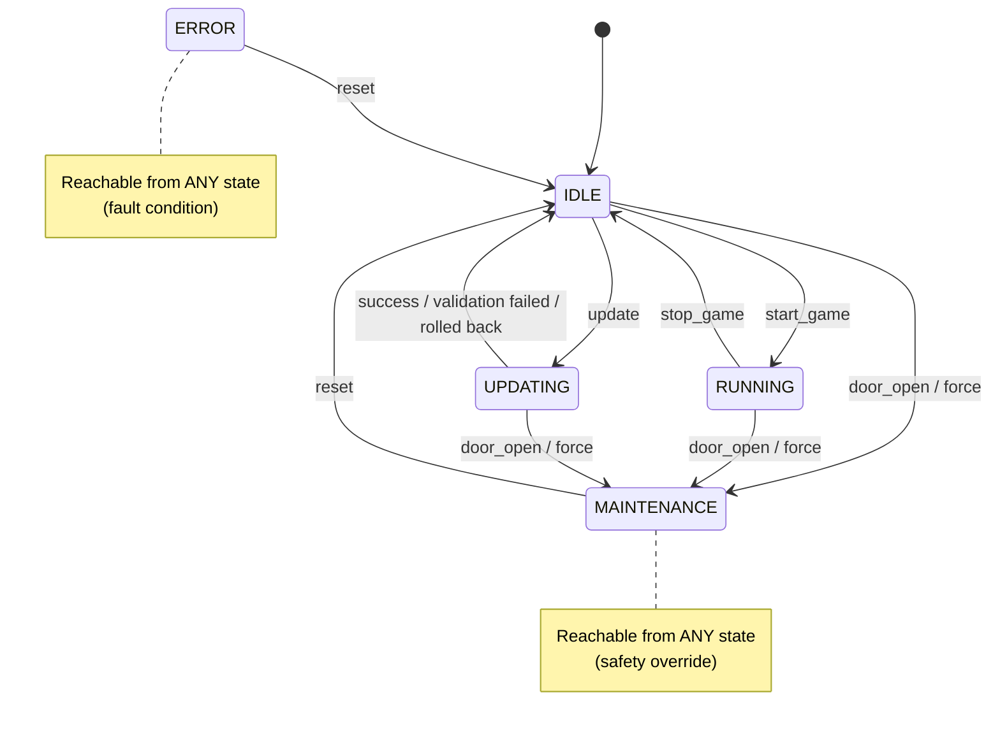
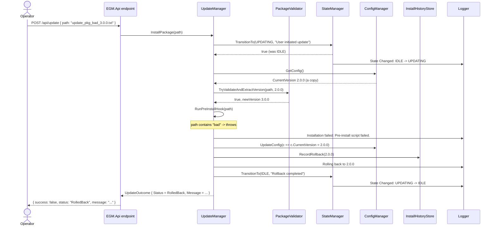

# EGM Architecture Guide

This document explains the design patterns, state machine, threading model, and architectural decisions behind the EGM Core Module.

Every code sample and claim below was checked against the source. Where a decision has a cost, the cost is stated rather than glossed.

---

## Table of Contents

1. [Two Front-Ends, One Core](#two-front-ends-one-core)
2. [Design Patterns](#design-patterns)
3. [State Machine](#state-machine)
4. [Update and Rollback Flow](#update-and-rollback-flow)
5. [Threading Model](#threading-model)
6. [Testing Strategy](#testing-strategy)
7. [Summary](#summary)

---

## Two Front-Ends, One Core

The project is built around **interface-driven architecture** — the same business logic serves two completely different interfaces:

- **EGM.Core** (`EGM.Core.csproj`, repo root) — interactive CLI with a command-processor loop
- **EGM.Api** (`EGM.Api/`) — ASP.NET Core Minimal API + React dashboard (no build step; React and Babel are vendored)

`EGM.Api` is a thin shell over a project reference to `EGM.Core`. It reuses the *same* service implementations:

| Service | Role |
|---------|------|
| `StateManager` | Finite state machine |
| `UpdateManager` | Transactional updates with rollback |
| `ConfigManager` | Persisted machine configuration |
| `InstallHistoryStore` | Append-only audit trail |
| `LoggerService` | File logger with rotation |
| `PackageValidator`, `TimeZoneValidator` | Input validation |
| `BillValidatorService` | Hardware simulator with heartbeat |

Only two things differ between the front-ends:

1. `ILogger` is wrapped in `CapturingLogger` so the browser can read log lines (see [Decorator](#5-decorator-capturinglogger)).
2. `CliProcessor` is **not** registered — HTTP endpoints replace typed commands as the operator interface.

**Why this matters**: In regulated industries (gaming, medical, aerospace), control logic must be **provably identical** across operational modes. Sharing the implementations rather than copying them means a fix in the state machine reaches both front-ends or neither.

**Trade-off**: The web dashboard needs a log buffer that the CLI does not. Rather than have core classes expose the buffer, the mismatch is absorbed by one decorator at the composition root — which keeps `EGM.Core` free of any knowledge that a web UI exists.

---

## Design Patterns

### 1. Finite State Machine (Explicit)
**Where**: `Services/StateManager.cs`

**Why**: EGM state transitions are safety-critical. A bug that allows "UPDATING while RUNNING" could corrupt a live game or fail an audit. An explicit allow-list makes the permitted paths **visible and testable**.

```csharp
private static bool IsValidTransition(EGMStateEnum current, EGMStateEnum next)
{
    // MAINTENANCE/ERROR can come from ANYWHERE (Safety First)
    if (next == EGMStateEnum.MAINTENANCE || next == EGMStateEnum.ERROR) return true;

    switch (current)
    {
        case EGMStateEnum.IDLE:        return next == EGMStateEnum.RUNNING || next == EGMStateEnum.UPDATING;
        case EGMStateEnum.RUNNING:     return next == EGMStateEnum.IDLE;
        case EGMStateEnum.MAINTENANCE: return next == EGMStateEnum.IDLE;
        case EGMStateEnum.UPDATING:    return next == EGMStateEnum.IDLE;
        case EGMStateEnum.ERROR:       return next == EGMStateEnum.IDLE;
        default:                       return false;
    }
}
```

**Benefit**: The permitted transitions are auditable at a glance, and the two escape hatches are enforced on the first line rather than repeated in every case.

**Note on the `default` arm**: `EGMStateEnum` has exactly five members and the switch names all five, so `default` is unreachable today. It is kept deliberately — adding a sixth state to the enum without touching this method should deny transitions, not silently permit them. This is the one branch the test suite does not exercise.

**Note on enforcement**: this is checked at **runtime**. An invalid transition returns `false` and logs a warning; it is not a compile-time guarantee. The type system cannot express "you may only call this from IDLE", so enforcement lives in this method plus `StateManagerTests`.

### 2. Observer (Event-Driven State Changes)
**Where**: `StateManager.OnStateChanged`

**Why**: The state manager is a **truth source**, not a notification dispatcher. Hardware services and UI layers subscribe without the StateManager being coupled to their existence.

Two properties matter, and both are load-bearing:

**(a) The event fires outside the lock.**

```csharp
lock (_lock)
{
    // validate + mutate state
    PerformTransition(newState, reason);
}

NotifyStateChanged(newState); // OUTSIDE the lock
```

If the event were raised while holding `_lock`, a subscriber that called back into `CurrentState` or `TransitionTo` would block forever on the same non-reentrant lock. Regression test: `StateManagerTests.Subscriber_ReentrantTransition_ShouldNotDeadlock`.

**(b) A no-op transition does not notify.** Requesting the state the machine is already in short-circuits before the transition is performed, so subscribers are not woken for a change that never happened. `ForceState` mirrors this — it previously did not, which meant forcing MAINTENANCE while already in MAINTENANCE logged a misleading `MAINTENANCE -> MAINTENANCE` and fired every subscriber. Test: `ForceState_WhenAlreadyInTargetState_ShouldNotFireEvent`.

### 3. Transactional Update with Compensating Action
**Where**: `UpdateManager.InstallPackage`

**Why**: An EGM software update is **transactional**: if any step fails (validation, pre-install hook, config write), the operation rolls back to the previous version. A half-applied update is worse than no update.

**Flow**:
1. Reject an empty path immediately
2. Transition to UPDATING — fail fast if the machine is not IDLE
3. Validate package format and version
4. Run the pre-install hook (a failure seam — see below)
5. Commit: write config, append to install history
6. **On failure**: `PerformRollback` restores the previous version, then transition back to IDLE

**The return type is the point.** `InstallPackage` returns `UpdateOutcome`, not `void`:

```csharp
public sealed record UpdateOutcome(
    UpdateStatus Status,          // Installed | Rejected | RolledBack
    string Message,
    Version? PreviousVersion = null,
    Version? InstalledVersion = null)
{
    public bool Succeeded => Status == UpdateStatus.Installed;
}
```

A `void` signature forced every caller to *assume* success. The HTTP endpoint in particular answered `success: true` unconditionally — including after a rollback — which is the worst possible failure mode for an audit-facing API: it reports the outcome the operator hopes for rather than the one that happened. Callers now read `outcome.Succeeded` and surface `outcome.Message`.

**The pre-install hook is a test seam.** `RunPreInstallHook` throws when the package path contains `"bad"`. That is intentional failure injection — it is how the rollback path is exercised end-to-end without corrupting a real file. It is not a production validation rule.

**Benefit**: The system is never left inconsistent, and every attempt — success, rejection, or rollback — is traceable in `install_history.json`.

### 4. Try-Parse Pattern (Defensive I/O)
**Where**: `FileFunctions.TryWriteFile` / `TryReadFile`; `PackageValidator.TryValidateAndExtractVersion`

**Why**: File I/O and string parsing fail in production for mundane reasons (disk full, permissions, corrupted file). Throwing from deep in the call stack forces try/catch noise into every caller. Try-Parse returns `bool` and populates `out` parameters, making failure a **first-class return value**.

```csharp
if (!FileFunctions.TryReadFile(path, out string content, out string error))
{
    _logger.Log(LogTypeEnum.Error, $"Read failed: {error}");
    return false;
}
```

**Side-effect-free reads**: `FileFunctions.LogDirectory` is a pure property — reading it creates nothing. Directory creation lives in `EnsureLogDirectory()`, which only the three services that actually write (`ConfigManager`, `LoggerService`, `InstallHistoryStore`) call. Previously the *getter* called `Directory.CreateDirectory`, so merely reading a path — from a status endpoint, a test, or a log line — wrote to disk.

**Benefit**: Call sites stay clean, error messages stay specific, and "did that read touch the filesystem?" is answerable by looking at the call.

### 5. Decorator (CapturingLogger)
**Where**: `EGM.Api/Services/CapturingLogger.cs`

**Why**: The React dashboard shows a live log panel, but `EGM.Core` must not know a web UI exists. `CapturingLogger` implements `ILogger`, forwards every call to the real `LoggerService`, and *additionally* appends the line to an `InMemoryLogBuffer` that an API endpoint serves to the browser.

This is a **production** decorator, wired at the API's composition root:

```csharp
services.AddSingleton<ILogger>(sp =>
{
    var real = new LoggerService();
    var buffer = sp.GetRequiredService<InMemoryLogBuffer>();
    return new CapturingLogger(real, buffer);
});
```

**Benefit**: The classic Decorator payoff — same interface, added behaviour, **zero changes to any `EGM.Core` class**. Adding the entire web front-end required editing one DI registration.

### 6. Facade (LoggerService)
**Where**: `Services/LoggerService.cs`

**Why**: The real logger does more than `ILogger.Log`: it timestamps every line, creates the Logs directory, and rotates the file at 5 MB (`_maxLogSizeBytes = 5 * 1024 * 1024`). `LoggerService` hides that behind `Log(level, message)`.

**Benefit**: No other class worries about rotation or file paths.

---

## State Machine

The EGM has five states. MAINTENANCE and ERROR are reachable from anywhere (safety overrides). All other transitions follow the diagram below.


```mermaid
stateDiagram-v2
    [*] --> IDLE

    IDLE --> RUNNING : start_game
    IDLE --> UPDATING : update
    IDLE --> MAINTENANCE : door_open / force

    RUNNING --> IDLE : stop_game
    RUNNING --> MAINTENANCE : door_open / force

    UPDATING --> IDLE : success / validation failed / rolled back
    UPDATING --> MAINTENANCE : door_open / force

    MAINTENANCE --> IDLE : reset
    ERROR --> IDLE : reset

    note right of MAINTENANCE
        Reachable from ANY state
        (safety override)
    end note

    note right of ERROR
        Reachable from ANY state
        (fault condition)
    end note
```

**Key rules**:
- **IDLE** is the only state from which `update` is permitted.
- **RUNNING → UPDATING is blocked** — you cannot patch a live game.
- **MAINTENANCE** and **ERROR** are escape hatches, reachable from any state.
- Enforced in `StateManager.IsValidTransition`.

**A failed update ends in IDLE, not ERROR.** This is the subtlest rule here and worth stating explicitly. A rollback is a *successful recovery*, not a fault: the machine has been restored to a known-good version and is safe to operate. ERROR is reserved for conditions the machine cannot clear by itself. (The `BillValidatorService` heartbeat is the one component that escalates on its own, and it escalates to MAINTENANCE.)

---

## Update and Rollback Flow

This sequence shows a **failed update** (the rollback branch). A successful update follows the same path and skips the rollback.


```mermaid
sequenceDiagram
    actor Operator
    participant API as EGM.Api endpoint
    participant UpdateManager
    participant PackageValidator
    participant StateManager
    participant ConfigManager
    participant InstallHistoryStore
    participant Logger

    Operator->>API: POST /api/update { path: "update_pkg_bad_3.0.0.txt" }
    API->>UpdateManager: InstallPackage(path)

    UpdateManager->>StateManager: TransitionTo(UPDATING, "User initiated update")
    StateManager-->>UpdateManager: true (was IDLE)
    StateManager->>Logger: State Changed: IDLE -> UPDATING

    UpdateManager->>ConfigManager: GetConfig()
    ConfigManager-->>UpdateManager: CurrentVersion 2.0.0 (a copy)

    UpdateManager->>PackageValidator: TryValidateAndExtractVersion(path, 2.0.0)
    PackageValidator-->>UpdateManager: true, newVersion 3.0.0

    UpdateManager->>UpdateManager: RunPreInstallHook(path)
    Note over UpdateManager: path contains "bad" -> throws
    UpdateManager->>Logger: Installation failed: Pre-install script failed.

    UpdateManager->>ConfigManager: UpdateConfig(c => c.CurrentVersion = 2.0.0)
    UpdateManager->>InstallHistoryStore: RecordRollback(2.0.0)
    UpdateManager->>Logger: Rolling back to 2.0.0

    UpdateManager->>StateManager: TransitionTo(IDLE, "Rollback completed")
    StateManager->>Logger: State Changed: UPDATING -> IDLE

    UpdateManager-->>API: UpdateOutcome { Status = RolledBack, Message = ... }
    API-->>Operator: { success: false, status: "RolledBack", message: "..." }
```

**Critical properties**:

1. **Atomicity** — if any step after validation fails, the previous version is restored before returning.
2. **Audit trail** — every attempt appends to `install_history.json`; rollbacks are recorded via `RecordRollback`.
3. **Honest reporting** — the caller receives a `status` of `Installed`, `Rejected`, or `RolledBack` rather than a boolean that assumes the best.
4. **State safety** — the machine returns to IDLE only after the rollback has completed, so a failed install never leaves it stuck in UPDATING.

**A note on `GetConfig()`**: it returns a defensive *copy*, not the live instance. `UpdateManager` reads `previousVersion` once and later mutates config through `UpdateConfig`; because the read was a copy, the captured `previousVersion` cannot be altered underneath the rollback. This small detail is doing real work — it is why the rollback restores the correct version.

**What "rollback" does and does not do**: it restores `CurrentVersion` to the value that was current *before the attempt*, and it does not touch `LastKnownGoodVersion`. In the sequence above the machine had already been updated to 2.0.0, so the failed install of 3.0.0 leaves it at 2.0.0 — not at the older last-known-good.

---

## Threading Model

### Singleton Services + Lock-Based Synchronization

`StateManager`, `ConfigManager`, `InstallHistoryStore`, and `LoggerService` are registered as **Singletons**. Therefore:

- The CLI loop (or HTTP requests) and the heartbeat timer share **the same instances**.
- A state change raised from one interface is immediately visible to the other.

**Why Singletons**: there is one physical machine with one state. Scoped or Transient services would create parallel universes.

### Lock Discipline (StateManager)

`StateManager` guards `_currentState` with a lock object, and the field is **not** `volatile` — the getter takes the same lock:

```csharp
private EGMStateEnum _currentState;
private readonly object _lock = new();

public EGMStateEnum CurrentState
{
    get { lock (_lock) return _currentState; }
}

public bool TransitionTo(EGMStateEnum newState, string reason)
{
    lock (_lock)
    {
        if (_currentState == newState) return true;      // no-op: no notify
        if (!IsValidTransition(_currentState, newState)) return false;
        PerformTransition(newState, reason);
    }

    NotifyStateChanged(newState); // OUTSIDE the lock
    return true;
}
```

**Why locking the getter beats `volatile`**: `volatile` would give visibility but not atomicity, and it documents an intent ("read without the lock") that the rest of the class does not honour. Routing every read and write through one lock makes the invariant checkable by inspection: *no field access outside `_lock`*. The cost is that a read briefly contends with a write — negligible here, since transitions are operator-driven and rare. (`BillValidatorService` does use `volatile` for its `_ackReceived` flag, where a single bool is genuinely all the coordination required.)

**Event-outside-lock**: as described under [Observer](#2-observer-event-driven-state-changes), firing the event while holding the lock would deadlock any subscriber that calls back in.

### Background Heartbeat (BillValidatorService)

`BillValidatorService` runs a `Timer` that fires **immediately** (due time `0`) and then every 10 seconds:

```csharp
private const int PingIntervalMs = 10000;
private const int TimeoutMs = 2000;

_heartbeatTimer = new Timer(async _ => await PingLoop(), null, 0, PingIntervalMs);

private async Task PingLoop()
{
    if (!_isRunning) return;
    _ackReceived = false;
    try
    {
        if (!_isSimulatedFailure)
        {
            await Task.Delay(500);
            ReceiveAck();               // sets _ackReceived = true
        }
        await Task.Delay(TimeoutMs);
        CheckForAck();                  // escalates to MAINTENANCE if still false
    }
    catch (Exception ex) { /* log */ }
}
```

**How failure is detected**: each tick clears `_ackReceived`, pings the device, waits 2 seconds, then checks whether an acknowledgement arrived. Two ways to suppress the ACK: `SetSimulatedFailure(true)` skips the ping entirely, and `ReceiveAck()` ignores acknowledgements while that flag is set. If no ACK lands, `CheckForAck` forces the machine into MAINTENANCE with reason `"Bill Validator Hardware Failure"` — an unresponsive bill validator means the machine cannot take money, so it must not stay in service.

**Idempotence**: `CheckForAck` only forces the transition if the machine is not already in MAINTENANCE, so a device that stays dead does not repeatedly re-fire the transition and spam every subscriber.

**Why a Timer, not a `Task.Delay` loop**: `Timer` callbacks run on the thread pool and hold no thread between ticks, and the next tick is scheduled from the timer's own clock rather than from the end of the previous callback.

**Scope of this guarantee**: this is the *only* place the system escalates to MAINTENANCE on its own. Everything else reaches MAINTENANCE because an operator asked for it.

---

## Testing Strategy

42 tests, 31.5% line coverage / 28.1% branch coverage overall. The number is low on purpose, and the distribution matters more than the total.

| Class | Line | Branch | Why there, why not higher |
|-------|------|--------|---------------------------|
| **StateManager** | 96.4% | 90.9% | Pure logic, fully mockable. The gap is the defensive `default` arm of `IsValidTransition`, unreachable while the enum has five members. |
| **UpdateManager** | 91.5% | 100% | Core transactional logic; every branch is taken. The uncovered lines are the two `UpdateConfig(cfg => ...)` **lambda bodies** — Moq records the call but does not invoke the `Action`, so the assignment inside never executes. Closing this needs a fake `IConfigManager`, not a mock. |
| **PackageValidator** | 100% | 100% | Stateless, no I/O — every branch reachable. |
| **TimeZoneValidator** | 100% | 100% | Wraps `TimeZoneInfo.FindSystemTimeZoneById`. |
| **FileFunctions** | 85.7% | 83.3% | Missing: the `FindProjectRoot` fallback for an assembly with no `.csproj` marker above it — needs a filesystem layout the test host cannot produce. |
| **ConfigManager** | 0% | 0% | Reads and writes real files. Needs an `IFileSystem` seam or temp-dir plumbing. |
| **InstallHistoryStore** | 0% | 0% | Same — direct file I/O. |
| **LoggerService** | 0% | 0% | Same — writes real logs, plus rotation. |
| **BillValidatorService** | 0% | 0% | Driven by a real `Timer`; testing it means either injecting `ITimer` or writing timing-dependent tests. |
| **CliProcessor** | 0% | 0% | Parses `Console.ReadLine()`. Needs `TextReader` injection. |
| **EGM.Api** | 0% | 0% | Not referenced by the test project at all. Its logic is endpoint glue over already-tested core services. |

### Why stop at 31.5%

**1. The untested code is infrastructure glue.** File I/O, console I/O, timers. Reaching 100% would require `IFileSystem`, `IConsole`, `ITimer`, and `IEnvironment` — four abstractions whose only implementation is the real one. That is real over-engineering for a project this size, and each seam makes the production path harder to follow.

**2. The decision logic is covered.** Every state transition, every validation branch, every update outcome, and the re-entrancy deadlock regression are asserted. Those are the rules an auditor would ask about. File-writing helpers are commodity code.

**3. The gaps are named, not hidden.** The table above says exactly which lines are uncovered and what it would take to cover them. A coverage number nobody can account for is worse than a lower number that is fully explained.

### What is tested

- **All state transitions** — valid, invalid, both escape hatches, no-op suppression, and re-entrant subscribers.
- **Update outcomes** — installed, rejected (empty path / not IDLE / validation failure), and rolled back.
- **Package validation** — format errors, version comparisons, missing files.
- **Timezone validation** — valid and invalid IDs, case-insensitivity, empty input.
- **File helpers** — round-trip, missing file, unwritable destination.

### Running the tests

```bash
dotnet test EGM.Core.Tests/EGM.Core.Tests.csproj

# with coverage
dotnet test EGM.Core.Tests/EGM.Core.Tests.csproj --collect:"XPlat Code Coverage"
```

CI runs both on every push to `main` — see [`.github/workflows/ci.yml`](.github/workflows/ci.yml).

> **Note on the test project's target framework.** `EGM.Core` and `EGM.Api` target `net8.0`; `EGM.Core.Tests` targets `net9.0`. On a machine whose SDK ships only newer runtimes (e.g. SDK 10), running the net9.0 test host requires `DOTNET_ROLL_FORWARD=Major`. CI avoids this by installing the 8.0.x and 9.0.x SDKs side by side.

---

## Summary

| Architectural Principle | Implementation | Why It Matters |
|------------------------|----------------|----------------|
| **Single Source of Truth** | Singleton services shared by CLI and API | State changes are immediately consistent across both front-ends. |
| **Explicit FSM** | `IsValidTransition` allow-list + guarded field | Invalid transitions are rejected at runtime, auditable, and covered by tests. |
| **Transactional Updates** | Try → Apply → Commit, with compensating rollback | A partial failure never leaves the machine inconsistent. |
| **Honest Outcomes** | `UpdateOutcome` instead of `void` | Callers report what happened, not what was hoped for — the API cannot claim success after a rollback. |
| **Event-outside-lock** | `NotifyStateChanged()` after releasing `_lock` | Prevents deadlock when subscribers call back into the StateManager. |
| **No-op Suppression** | Same-state transitions short-circuit without notifying | Subscribers are not woken for changes that did not occur. |
| **Pure Reads** | `LogDirectory` (pure) vs `EnsureLogDirectory()` (creates) | Reading a path never writes to disk. |
| **Try-Parse over Exceptions** | `bool TryX(out result, out error)` | Failure is a first-class return value; call sites stay clean. |
| **Decorator at the Edge** | `CapturingLogger` wraps `ILogger` in `EGM.Api` only | A second front-end was added without touching a single core class. |
| **Test the Decisions, Not the Plumbing** | 86–100% on logic; 0% on I/O glue | Proves correctness without mocking the platform. |

For setup and usage, see [README.md](README.md). For a quick start in a new session, see [CLAUDE.md](CLAUDE.md).
