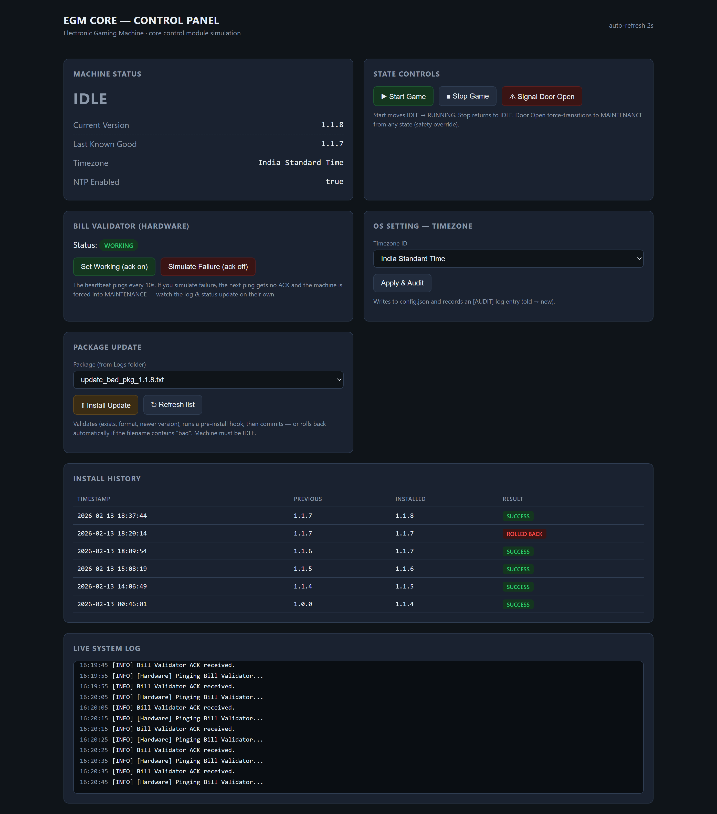
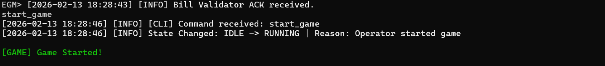
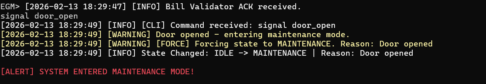
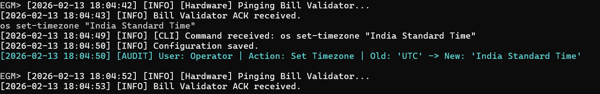
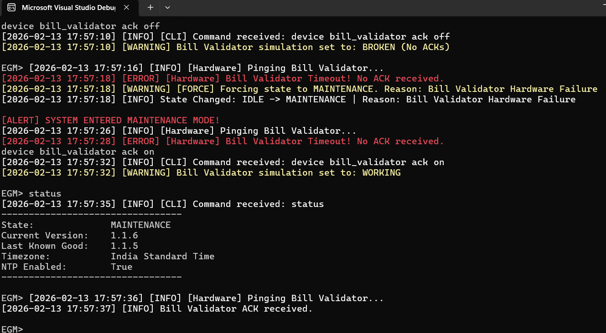

# EGM Core Module

[](https://github.com/xDivyanshx/EGM/actions/workflows/ci.yml)

This project simulates the core control module of an Electronic Gaming Machine (EGM) — the software inside a casino slot machine. It demonstrates robust state management, hardware simulation, transactional updates with rollback, and audit logging.

It ships with **two front-ends over one shared core**:

- **CLI** — the original interactive console (`EGM.Core`)
- **Web dashboard** — a React UI over a REST API (`EGM.Api`)

Both reuse the identical business logic, demonstrating interface-driven, swappable architecture.

> For design patterns, state diagrams, and threading details, see **[ARCHITECTURE.md](ARCHITECTURE.md)**.

## Prerequisites

* **OS**: Windows, Linux, or macOS.
* **.NET SDK**: Version 8.0 or later. (On a machine whose SDK ships only newer runtimes, set `DOTNET_ROLL_FORWARD=Major` — see the [testing note](ARCHITECTURE.md#running-the-tests).)
* **IDE (Optional)**: Visual Studio 2022 or VS Code.

## Project Structure

* `.` (repo root): the console application — `EGM.Core.csproj`, `Program.cs`, `Services/`, `Validators/`, `Persistence/`, `Interfaces/`, `Entities/`, `Enums/`.
* `EGM.Api/`: Web API + React dashboard (no build step — vendored React UMD + Babel).
* `EGM.Core.Tests/`: Unit tests using xUnit and Moq (42 tests).
* `Logs/`: Logs, configuration, install history, and sample update packages.

## How to Run

### CLI (Console Application)

1.  **Open a terminal** at the repository root (where `EGM.Core.csproj` lives).
2.  **Build the project**:
    ```bash
    dotnet build
    ```
3.  **Run the application**:
    ```bash
    dotnet run
    ```
4.  You will see the `EGM>` prompt indicating the CLI is ready.

### Web Dashboard (API + React UI)

1.  **Open a terminal** in the `EGM.Api` folder.
2.  **Build and run**:
    ```bash
    dotnet run
    ```
3.  **Open your browser** to `http://localhost:5080`.

The dashboard provides real-time status, interactive controls (start/stop game, door signal, device simulation), configuration management, package updates, and log browsing — all over the same core business logic used by the CLI.



---

## 5-Step Demonstration Sequence

To verify the 5 required behaviors (Game Update, Door Open, Bill Validator, OS Settings, and State Machine), follow this exact command sequence.

### **Preparation**

The sample update packages already ship in the `Logs` folder, so no manual setup is needed:

- `update_pkg_2.0.0.txt` — a valid package (successful update).
- `update_pkg_bad_3.0.0.txt` — a package whose name contains `bad`, which the system is programmed to reject (triggers rollback).

If they are missing, just create two empty text files with those exact names inside `Logs`.

### **Step 1: State Machine & Logging (Behavior #5)**

Test standard state transitions and verify logging output.

```text
EGM> status
---------------------------------
State:              IDLE
Current Version:    1.1.8
Last Known Good:    1.1.7
Timezone:           India Standard Time
NTP Enabled:        True
---------------------------------
```

```text
EGM> start_game
```

Output:



### **Step 2: Door Open Signal (Behavior #2)**

Simulate a security event that forces the game to stop.

```text
EGM> signal door_open
```

Output:



Verification: Type `status` to confirm State is now MAINTENANCE.

Action: Reset the system to IDLE to continue testing:

```text
EGM> stop_game

Output:
[2026-02-13 17:26:17] [INFO] [CLI] Command received: stop_game
[2026-02-13 17:26:17] [INFO] State Changed: MAINTENANCE -> IDLE | Reason: Operator stopped game
```

### **Step 3: OS Setting Change & Audit (Behavior #4)**

Change a configuration setting and verify the audit log.

```text
EGM> os set-timezone "India Standard Time"
```



### **Step 4: Bill Validator Keep-Alive (Behavior #3)**

Simulate a hardware failure. The system pings every 10 seconds and waits 2 seconds for an acknowledgement; with the device "broken" the ACK never arrives and the machine is forced into MAINTENANCE.

```text
EGM> device bill_validator ack off
```

Output:



### **Step 5: Update with Rollback (Behavior #1)**

Test a successful update and a failed update (triggering rollback).

#### A. Successful Update

```text
EGM> update --package "Logs/update_pkg_2.0.0.txt"
[2026-10-07 12:31:22] [INFO] [CLI] Command received: update --package "Logs/update_pkg_2.0.0.txt"
[2026-10-07 12:31:22] [INFO] [Update] Starting installation for: Logs/update_pkg_2.0.0.txt
[2026-10-07 12:31:22] [INFO] State Changed: IDLE -> UPDATING | Reason: User initiated update
[2026-10-07 12:31:22] [INFO] [Update] Package validated. Target version: 2.0.0
[2026-10-07 12:31:22] [INFO] [Update] Running pre-install script...
[2026-10-07 12:31:23] [INFO] Configuration saved.
[2026-10-07 12:31:23] [INFO] [Update] Installation successful. Active version: 2.0.0
[2026-10-07 12:31:23] [INFO] State Changed: UPDATING -> IDLE | Reason: Update completed successfully
Installed 2.0.0 (was 1.1.8).
```

#### B. Failed Update (Rollback)

The system is programmed to fail any package containing the word "bad" in the filename.

```text
EGM> update --package "Logs/update_pkg_bad_3.0.0.txt"
[2026-10-07 12:31:23] [INFO] [CLI] Command received: update --package "Logs/update_pkg_bad_3.0.0.txt"
[2026-10-07 12:31:23] [INFO] [Update] Starting installation for: Logs/update_pkg_bad_3.0.0.txt
[2026-10-07 12:31:23] [INFO] State Changed: IDLE -> UPDATING | Reason: User initiated update
[2026-10-07 12:31:23] [INFO] [Update] Package validated. Target version: 3.0.0
[2026-10-07 12:31:23] [INFO] [Update] Running pre-install script...
[2026-10-07 12:31:24] [ERROR] [Update] Installation failed: Pre-install script failed.
[2026-10-07 12:31:24] [WARNING] [Update] Rolling back to 2.0.0
[2026-10-07 12:31:24] [INFO] Configuration saved.
[2026-10-07 12:31:24] [INFO] State Changed: UPDATING -> IDLE | Reason: Rollback completed
Install of 3.0.0 failed and was rolled back to 2.0.0: Pre-install script failed.
```

Three things this output is demonstrating:

- The final line is the **operator-facing outcome** (`UpdateOutcome.Message`). The install method returns a status — `Installed`, `Rejected`, or `RolledBack` — rather than `void`, so a rollback can no longer be reported as a success.
- The state after a failed update is **IDLE, not ERROR**. A rollback is a successful recovery, and the machine is safe to keep operating.
- The rollback restored **2.0.0**, the version that was current *before the attempt* — not the older last-known-good. `LastKnownGoodVersion` is not touched by a rollback.

> Timestamps and the interleaved bill-validator heartbeat lines are from a real session; the heartbeat lines are omitted above for readability.

## Log Files

All events are persisted to disk in the `Logs` directory. Log rotation is implemented to prevent excessive disk usage (each log file is limited to 5 MB).

- **system.log**: General operational logs.
- **install_history.json**: Record of updates and rollbacks.
- **config.json**: Persisted state of the machine.

`config.json` and `install_history.json` are intentionally tracked in git so the sequence above starts from the same version on a fresh clone. `system.log` grows on every run and is gitignored.

---

## Testing

The project includes 42 unit tests covering core business logic:

```bash
dotnet test EGM.Core.Tests/EGM.Core.Tests.csproj
```

For code coverage:

```bash
dotnet test EGM.Core.Tests/EGM.Core.Tests.csproj --collect:"XPlat Code Coverage"
```

Coverage is **31.5%** overall, concentrated where it matters: `StateManager` 96.4%, `UpdateManager` 91.5%, `PackageValidator` and `TimeZoneValidator` 100%. The untested remainder is file I/O, console I/O, and timer code — [ARCHITECTURE.md explains the trade-off](ARCHITECTURE.md#why-stop-at-315) and names every uncovered line rather than hiding behind the total.

---

## Architecture

For design patterns, state machine diagrams, threading model, and the two-front-ends-one-core rationale, see **[ARCHITECTURE.md](ARCHITECTURE.md)**.

---

## License

[MIT](LICENSE) © Divyansh Agarwal
