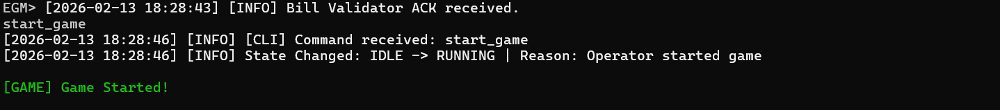
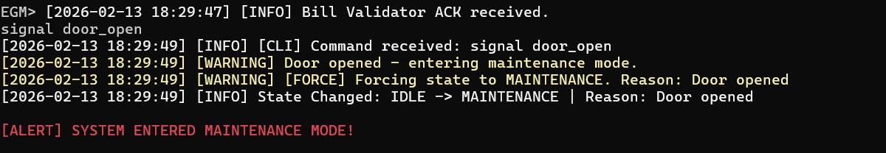
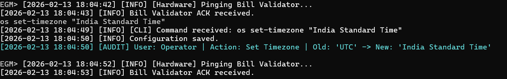
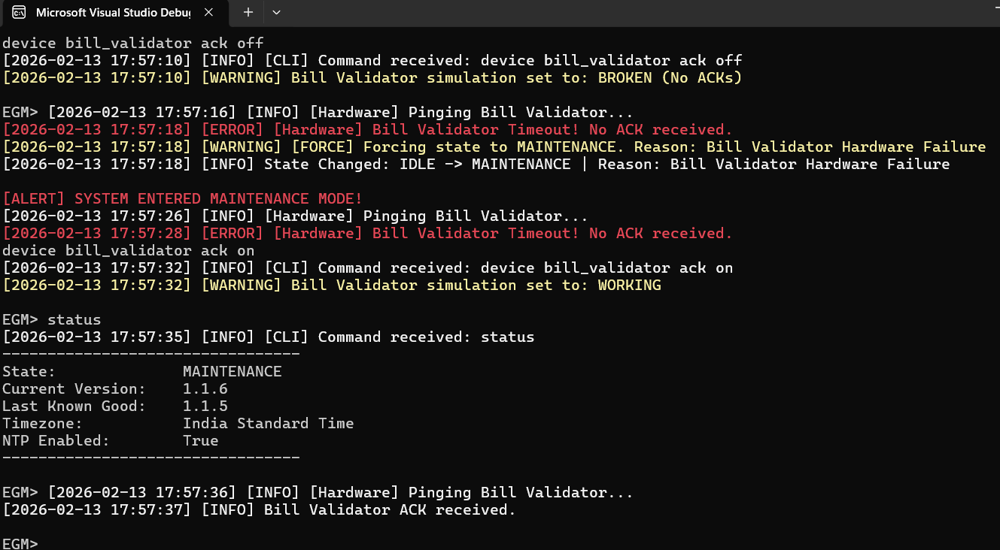
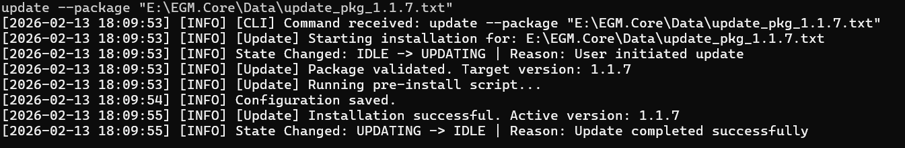
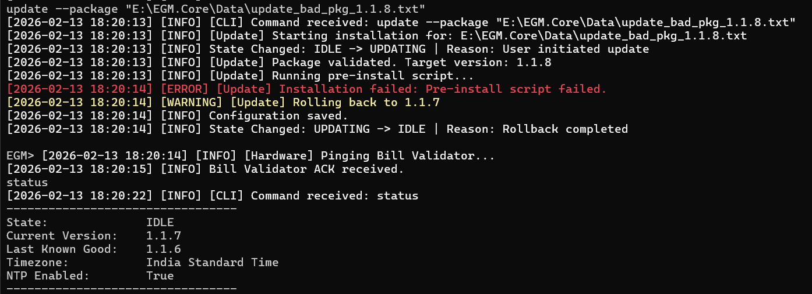

# EGM Core Module

This project simulates the core control module of an Electronic Gaming Machine (EGM) — the software inside a casino slot machine. It demonstrates robust state management, hardware simulation, transactional updates with rollback, and audit logging.

It ships with **two front-ends over one shared core**:
- **CLI** — the original interactive console (`EGM.Core`)
- **Web dashboard** — a React UI over a REST API (`EGM.Api`)

Both reuse the identical business logic, demonstrating interface-driven, swappable architecture.

> For design patterns, state diagrams, and threading details, see **[ARCHITECTURE.md](ARCHITECTURE.md)**.

## Prerequisites

* **OS**: Windows, Linux, or macOS.
* **.NET SDK**: Version 8.0 or later. (On machines with only newer SDKs installed, set `DOTNET_ROLL_FORWARD=Major`.)
* **IDE (Optional)**: Visual Studio 2022 or VS Code.

## Project Structure

* `EGM.Core/`: Main console application source code.
* `EGM.Api/`: Web API + React dashboard (no build step — vendored React UMD + Babel).
* `EGM.Core.Tests/`: Unit tests using xUnit and Moq (40 tests).
* `Logs/`: Stores logs, configuration, install history, and sample update packages.

## How to Run

### CLI (Console Application)

1.  **Open a terminal** in the `EGM.Core` folder.
2.  **Build the project**:
    ```bash
    dotnet build
    ```
3.  **Run the application**:
    ```bash
    dotnet run
    ```
4.  You will see the `EGM>` prompt indicating the CLI is ready.

### Web Dashboard (API + React UI)

1.  **Open a terminal** in the `EGM.Api` folder.
2.  **Build and run**:
    ```bash
    dotnet run
    ```
3.  **Open your browser** to `http://localhost:5080`.

The dashboard provides real-time status, interactive controls (start/stop game, door signal, device simulation), configuration management, package updates, and log browsing — all over the same core business logic used by the CLI.

---

## 5-Step Demonstration Sequence 

To verify the 5 required behaviors (Game Update, Door Open, Bill Validator, OS Settings, and State Machine), follow this exact command sequence.

### **Preparation**
The sample update packages already ship in the `Logs` folder, so no manual setup is needed:
- `update_pkg_2.0.0.txt` — a valid package (successful update).
- `update_pkg_bad_3.0.0.txt` — a package whose name contains `bad`, which the system is programmed to reject (triggers rollback).

If they are missing, just create two empty text files with those exact names inside `Logs`.

### **Step 1: State Machine & Logging (Behavior #5)**
Test standard state transitions and verify logging output.

```text
EGM> status

Output:
 ---------------------------------
State:              IDLE
Current Version:    1.1.8
Last Known Good:    1.1.7
Timezone:           India Standard Time
NTP Enabled:        True
---------------------------------
```
```text
EGM> start_game
```
Output:


### **Step 2: Door Open Signal (Behavior #2)**
Simulate a security event that forces the game to stop.

```Text
EGM> signal door_open
```
Output:


Verification: Type status to confirm State is now MAINTENANCE.

Action: Reset the system to IDLE to continue testing:
```Text
EGM> stop_game

Output: 
[2026-02-13 17:26:17] [INFO] [CLI] Command received: stop_game
[2026-02-13 17:26:17] [INFO] State Changed: MAINTENANCE -> IDLE | Reason: Operator stopped game
```

### **Step 3: OS Setting Change & Audit (Behavior #4)**
Change a configuration setting and verify the audit log.
```text
EGM> os set-timezone "India Standard Time"/"Eastern Standard Time"
```


### **Step 4: Bill Validator Keep-Alive (Behavior #3)**
Simulate a hardware failure. The system pings every 10 seconds.

```text
EGM> device bill_validator ack off
```
Output:


### **Step 5: Update with Rollback (Behavior #1)**
Test a successful update and a failed update (triggering rollback).

### A. Successful Update
```
EGM> update --package "Logs\update_pkg_2.0.0.txt"
```
Output:


### B. Failed Update (Rollback)
The system is programmed to fail any package containing the word "bad" in the filename.

```
EGM> update --package "Logs\update_pkg_bad_3.0.0.txt"
```

Output:



## Log Files

All events are persisted to disk in the `Logs` directory. Log rotation is implemented to prevent excessive disk usage (each log file is limited to 5MB).

- **system.log**: General operational logs.
- **install_history.json**: Record of updates and rollbacks.
- **config.json**: Persisted state of the machine.

---

## Testing

The project includes 40 unit tests covering core business logic:

```bash
cd EGM.Core.Tests
dotnet test
```

For code coverage:

```bash
dotnet test --collect:"XPlat Code Coverage"
```

Coverage: **29.2%** overall; pure-logic classes (StateManager, PackageValidator, TimeZoneValidator, UpdateManager) at 92–100%.

---

## Architecture

For design patterns, state machine diagrams, threading model, and two-front-ends-one-core rationale, see **[ARCHITECTURE.md](ARCHITECTURE.md)**.